# Keywords {#keywords}

Keywords are an extremely helpful way of finding literature. Once you know what the keywords are for your topic, you should be able to find most papers that are published on your topic with very little effort. Getting to know exactly what keywords will lead you to this state of nirvana is a little more complex. Nevertheless, this is a great place to start in your postgraduate journey. 

Also remember that keywords are dynamic and you can always modify and build your own collection. Perhaps most powerful of all are the ways in which you can use [Boolean search terms or operators](https://howtowriteaphd.org/databases.html#boolean-terms-or-operators) to generate your exact keyword search. If you are not familiar with these operators (*AND*, *OR*, *NOT*) then it's a good idea to read up on these now (see [here](https://howtowriteaphd.org/databases.html#boolean-terms-or-operators)).

## Becoming familiar with the literature in your topic

One of the most important aspects of getting started with your MSc or PhD is to be familiar with the literature on your topic. For the first week of our course we will investigate how to:

- [Turning your topic into keywords](#topic)
- [Finding your keywords](#finding)
- [Visualising your keywords](#visualising)
- [Set up an alert](#alert)


## Turning your topic into keywords {#topic1}

For the first stage of this session, you will need to identify a topic. First choice is for you to use the topic that you are going to study for your MSc or PhD. If you do not have a topic, try asking (or writing to) your advisor for three to five papers that they think are key to your understanding of your topic. If you still have nothing, I have developed three potential topics for a MSc or PhD student and you will use one of these. You will find these [here](#topics)
We will be working with literature databases. If you are not familiar with them, read the chapter here: https://howtowriteaphd.org/databases.html 

### Identify keywords for your study
There are two sets of keywords for any published paper. Those provided by the authors and those automatically generated by each citation database. Be aware that some authors do not choose keywords well, which is why those generated by the citation database might be better. I suggest that you consider both.

#### Author selected keywords

Every paper published comes with a list of key words that the authors have chosen. These are usually listed under the abstract of the paper (Figure \@ref(fig:keywords-paper)).

(ref:keywords-paper) **Finding the Keywords on a published paper.** The author-selected keywords on each paper can usually be found listed under the abstract.

```{r keywords-paper, echo=FALSE, fig.align='center', out.width='90%', fig.cap="(ref:keywords-paper)"}
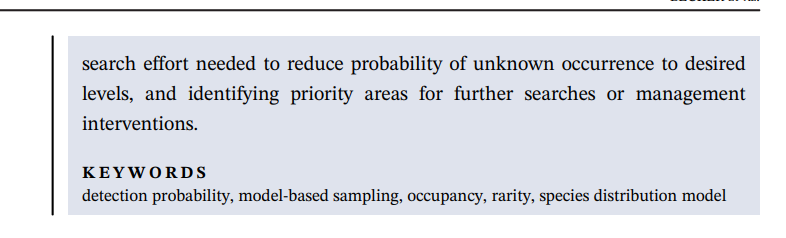
```


#### Database created keywords

In addition to those listed by the authors, most databases automatically generate their own list of key words for each paper that they list. I am going to suggest that you keep lists of both of these separately. For the paper that you saw above, the key words listed on [ISI Web-of-Science](https://www.webofscience.com/wos/alldb/basic-search) are shown in Figure \@ref(fig:keywords-database)).


(ref:keywords-database) **Finding the Keywords in a citation database.** Both the author-selected keywords and those generated by the database are listed seperately under the abstract on each entry of each paper. That shown here is from the database [Web of Science](https://www.webofscience.com/wos/alldb/basic-search) using Figure \@ref(fig:keywords-paper).

```{r keywords-database, echo=FALSE, fig.align='center', out.width='90%', fig.cap="(ref:keywords-database)"}
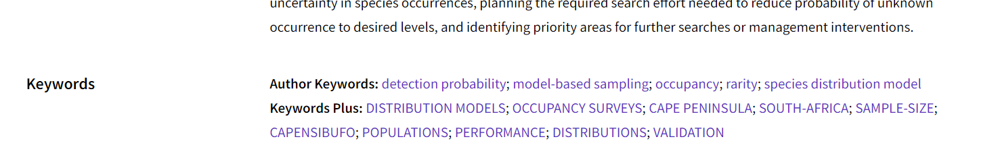
```

***

## Exercise 1: Finding your keywords {#finding}

This exercise is to show you how to identify keywords for your own study. The keywords that you identify today should be useful for you moving forwards. But as you continue with your studies, you will find ways in which to add and modify your keyword searches. Some of these keywords will stay with you throughout your studies, others will change. The keyword searchline that you end up with will be dynamic. 

1. Take each paper you have been given and write down the key words into a spreadsheet with two headings: author keywords and keywords plus (or whatever the name is from your preferred database – **Indexed Keywords** in [Scopus](https://www.scopus.com/search/form.uri?display=basic#basic)) 
1. If you already have papers that you have been given by your advisor, then start to make your list of key words from those listed on these papers 
1. Now take the next paper and do the same thing, adding to your list
1. Now make a list of variables that you know you are going to measure during your study. These will be the defining variables that you use in your hypothesis. If you don’t know what they are yet, read the papers you have and see what variables they have in common and list these. If you really still don't know what variables you will be using to measure the outcomes of your experiments, then you will need to come back to this section later in your postgraduate studies and update your keyword search once you know.
1. You should now have two or three lists that are longer than the ones that appear in Figure \@ref(fig:keywords-spreadsheet))
1. If you feel that you don’t have enough keywords, use your literature database to search through the citations to each of the papers that you were given. From this list, choose the most appropriate papers, and record their keywords into your list. 


(ref:keywords-spreadsheet) **Creating your own list of keywords from different sources.** In this example, I have listed the keywords from the example in Figure \@ref(fig:keywords-paper)

```{r keywords-spreadsheet, echo=FALSE, fig.align='center', out.width='90%', fig.cap="(ref:keywords-spreadsheet)"}
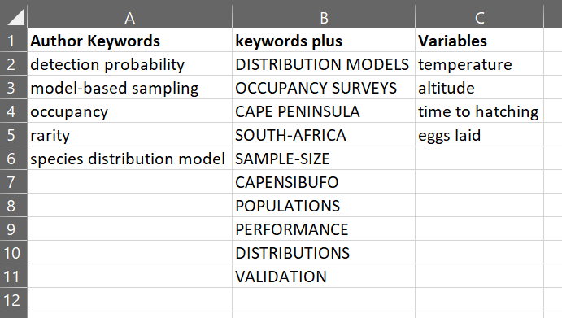
```
 

### Curating your keyword database

Now that you have a keyword database, you need to go through it and make sure that all of the contents are still on topic. Here are some pointers about what to keep and what to delete. In this first set of keywords, you are looking for a list total of 10 to 20. If you cannot reduce these sufficiently, then do your best.

 - add any obvious keywords that you think are missing from the previous exercise
 - if you are interested in particular taxa (species, genera or families) add a separate column to include these
 - Remove any duplicates
 - delete any keywords that you feel really do not apply to your topic
 - delete geopolitical names - like country names or administrative regions. Including geopolitical names might cause you to narrow your search too much, missing important papers coming from overseas, so it is better to remove these names

### Learning about Boolean operators 

Now we are going to use our keywords to make a search in a literature database. Go to your chosen database and use each list of keywords with Boolean AND between them and Boolean OR among groups. More detailed information on Boolean operators is available [here](https://howtowriteaphd.org/databases.html#boolean-terms-or-operators). Table \@ref(tab:Boolean) shows the typical Boolean operators and their meanings.


Table: (\#tab:Boolean) **Boolean operators and examples of how to use them.** Boolean operators are of pivotal importance when combining your search terms. Examples are taken from Figure \@ref(fig:keywords-paper).

| Boolean operator | Function | Example |
|-|-|-|
| **AND** |	Results that contains both keywords |	occupancy AND detection |
| **OR**	| Results that contain either keyword | temperature OR altitude |
| **NOT** | Results that contain one keyword but and the other | temperature NOT altitude |
| Quotation marks **“”** | Results with the exact phrase |	“time to hatching” |

### Wildcards
Most literature databases allow you to search using different wildcards. These are *, $ and ?. These can be placed at any point within a search term and help overcome differences in spelling, or families of words that you may want to capture or exclude in your search.

Use * when you want to replace a set of letters at the end of a word. For example, _reptil*_ will return all terms including Reptilia, reptile and reptiles.
Use ? when you want to search for any single letter at that place in a word. For example, sterili?e will capture words with sterilize and sterilise.
Use $ when there is more than a single letter that might change within a word, or the omission of a letter. For example, colo$r will return both US and UK spelling, color and colour, respectively. Note that Scopus doesn’t use the $ symbol as a wildcard: for this example you can use ? instead.

#### Use of brackets

The most powerful use of Boolean operators is when you combine your keywords and operators into brackets. Brackets allow you to produce a string of alternative keywords together (using **OR**) and then join them with another group of keywords (using **AND**). At the same time, you can exclude a whole group of papers that keep popping up in your searches (like those in human health).


Taking the results from our example above, we can conduct a simple Boolean search using all the keywords mentioned for each of the topics. This is a very restrictive way of searching, and we would expect that it would results in a very small set of results (and it does N = 86), and they are not particularly helpful. The point here is that you can think of this example as a way of using brackets. 

(ref:keywords-Boolean) **A simple way to use Boolean operators in a search term.** In this example, I have taken the keywords from Figure \@ref(fig:keywords-database)) and used a simple **AND** operator between them. This means that for this search, the papers need to have all the keywords listed in each row, **OR** those listed in the next row. 

```{r keywords-Boolean, echo=FALSE, fig.align='center', out.width='90%', fig.cap="(ref:keywords-Boolean)"}
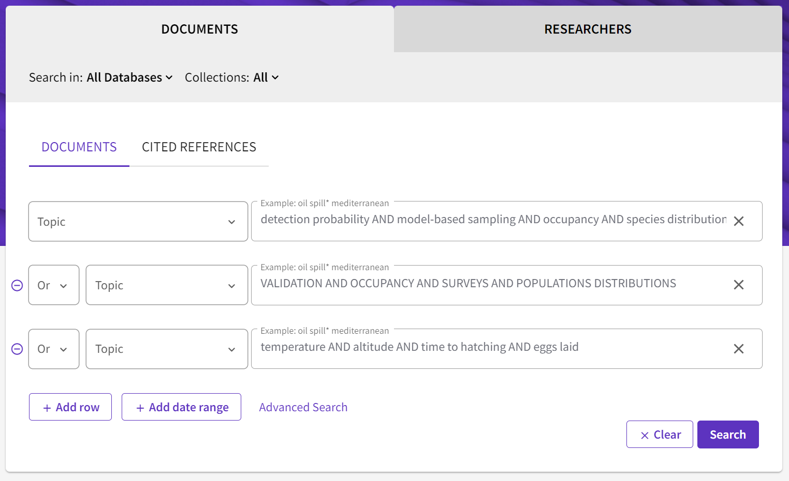
```

If you wrote out this sample example using brackets (for Web of Science) it would look like this:


```TS=("detection probability" AND "model-based sampling" AND occupancy AND species distribution) OR TS=(VALIDATION AND OCCUPANCY AND SURVEYS AND "POPULATION DISTRIBUTIONS") OR TS=(temperature AND altitude AND "time to hatching" AND "eggs laid")```  

Note that here TS (meaning TOPIC is abbreviated to TS= before each set of bracketed terms). Using this kind of term, you can use the [**Advanced Search Query Builder**](https://www.webofscience.com/wos/alldb/advanced-search) to build your search term. 

Try this now:
1. Copy and paste the above term into the [**Advanced Search Query Builder**](https://www.webofscience.com/wos/alldb/advanced-search) and see what results you get
1. Next try these second and third advanced search terms (below) and see what results you get
1. What has changed between these two search terms and why are they so very different?
1. Which do you think will be the most useful, and why?
1. All of the search terms have remained the same, so how has the use of brackets changed this [**Advanced Search Query Builder**](https://www.webofscience.com/wos/alldb/advanced-search)?

```TS=("detection probability" OR "model-based sampling" OR occupancy OR species distribution) AND TS=(VALIDATION OR OCCUPANCY OR SURVEYS OR "POPULATION DISTRIBUTIONS") AND TS=(temperature OR altitude OR "time to hatching" OR "eggs laid")```

```TS=("detection probability" OR "model-based sampling" OR occupancy OR species distribution OR VALIDATION OR OCCUPANCY OR SURVEYS OR "POPULATION DISTRIBUTIONS") AND TS=((temperature OR altitude) AND ("time to hatching" OR "eggs laid"))```

#### Use of Field Tags

In the above search term **TS** is a field tag for Topic which includes anything in the Title, Abstract or Keywords. If you only wanted to search within the keywords, you could use **AK** (author keywords) or **KP** ([keywords plus](https://support.clarivate.com/ScientificandAcademicResearch/s/article/KeyWords-Plus-generation-creation-and-changes?language=en_US)) (see Table \@ref(tab:field-tags)). There are a lot more Field Tags that you can use to narrow or broaden your search. Some of these are listed below for Web of Science.

Table: (\#tab:field-tags) **Field Tags (from Web of Science) and some examples of how to use them.** You can use any of these Field Tags to further refine your search, and it's easy to set up an alert once you've found an advanced search query that works well for you (see [below]()). *If you want to search within a range of dates, you need to add this in addition to your advanced search term (underneath).


| Field Tag | use | example |
| - | - | - |
| **TS** | TS=Topic | ```TS=("detection probability" OR "model-based sampling")``` |
| **TI** | TI=Title | ```TI=("model-based sampling" OR occupancy)``` |
| **AB** | AB=Abstract | ```AB=(occupancy OR species distribution)``` |
| **AK** | Author Keywords | ```AK=("time to hatching" OR "eggs laid")``` |
| **KP** | KP=Keyword Plus® | ```KP=(VALIDATION OR OCCUPANCY OR SURVEYS)``` |
| **PY** | PY=Year Published* | ```PY = 2010``` |

### Polishing your choice of keywords

So far we have used combinations of existing keywords to make searches that provide us with lots of results in our literature database. In order to find the best advanced search term, you now need to look at the resulting output of your searches. 

1. Choose an advanced search term that has generated ~1000 outputs. 
1. Next look through these outputs and see whether the titles are relevant to your topic. 
1. All five of your starting references (see [here](#finding)) should be present in this output.
1. Looking at all of the content, choose the most relevant five publications (that you really want to read) that are not in your original five. Look at their keywords and see how they match your search term. 
1. Use any of these additional keywords to refine your advanced search term to see whether you can improve your search.
1. Go back to the beginning of this list and keep refining and polishing your search term so that:
  + There are between approximately 500 and 1500 results
  + More than 95% of the results are relevant to your topic
  + You aren't getting anything more interesting

If your search results look uninteresting or irrelevant to [your study topic](#topic1) then something has gone wrong with your advanced search term, and you need to look at it again. 

1. Look through everything the entire output and make two lists of those that are relevant and those that are not
  + Look through the output of relevant papers and decide on the best 5 which should be exactly what you want, but not in the list that you input above
1.	it is the combination of keywords that are important here. Make a new list with these combinations. In addition, list each of the keywords of each of these papers found.
  + and those that are of no interest
1.	see which keywords are being flagged up most frequently in each of these groups. Some keywords and combinations are going to be too general to be useful. You can delete these from your lists.
  + You should have some new keywords and some that have been removed. There should be less than 10 in total. If not, then you need to repeat the steps again until you feel more confident about which keywords are getting you the results that you want.


1.	In the next step, you are going to rank your keywords into those that you think are most relevant and those you think are least. 
a.	Now you are going to take the top 5 and enter them into the literature database with Boolean AND between them. This should give you a very small list (~20) but with everything in it being what you really want to read. If not, then go back to the previous step and refine your keywords again
b.	Next you need to change your Boolean operators from AND to OR between some of these keywords. Use your knowledge of the subject to decide what to try first. What we are looking for is a good combination of AND and OR operators so that we get around 1000 results. Looking through the first 100 results should give you lots of titles where you want to read the abstracts (or at least recognize that they are relevant to your study). 
 

***

## Exercise 2: Visualising your keywords {#visualising}
 
In this exercise we are going to use the output of [Exercise 1](#finding) to visualise these keywords in a network. This will help us:

 - discover more and relevant keywords
 - see how keywords change over time
 - learn which keywords are synonymous
 - find out which authors are associated with which topics
 
(ref:keywords-output) **The output from [Exercise 1](#finding).** In this example, I polished my keywords from Exercise 1 until I found a relevant combination that produced around 1500 results. 

```{r keywords-output, echo=FALSE, fig.align='center', out.width='90%', fig.cap="(ref:keywords-output)"}
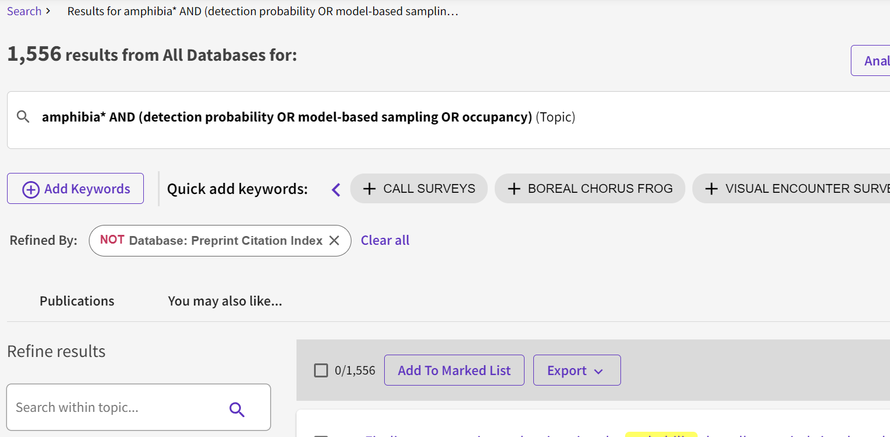
```

Note that Yunnan University subscription of WoS does not allow exporting of keywords and citations, so we cannot use it here. From here on, we will use [Scopus](https://www.scopus.com/search/form.uri?display=basic#basic). You will need to familiarise yourself with Scopus, and learn how to recreate your search term in this literature database.

### Export your results:
1.	Scopus: All > Export > Bibiographic Infor AND Citation Info | in batches of 2000. 
1. If you need to export more than one file, make sure to choose the same fields and combine your results before moving on.

(ref:keywords-export) **Exporting the output from [Exercise 1](#finding) using Scopus.** Here I have selected the **Citation information** and **Abstract & keywords** to be downloaded in CSV file format.  

```{r keywords-export, echo=FALSE, fig.align='center', out.width='90%', fig.cap="(ref:keywords-export)"}
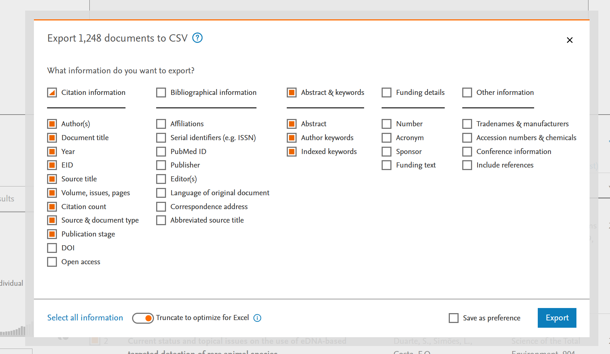
```


### Making a visualisation network

We are going to use software called VOSViewer. You should read the following chapter before you continue to get some background on how to use VOSViewer [here](https://howtopublishscience.org/advisorless.html#calculating-the-size-of-your-network).

Download VOSViewer [here](https://www.vosviewer.com/download)

Once you have downloaded and installed VOSViewer on your computer, you can follow the following steps:

 - Open VOSViewer and go to Map > Create
   +	Create map based on bibliographic data
   + Read data from bibliographic database files
   + Select Scopus and find your file saved above
   + Select co-occurrence and author keywords
   + Explore selecting different types of analyses and counting methods in VOSViewer
   + Save your keyword output network

**NB** If you don't have the option to select keywords, then you may not have exported your citations with keywords. See Figure \@ref(fig:keywords-export)) and try again. 

The first output created (Figure \@ref(fig:keywords-VOSV1)) shows us how different keywords are connected. Stronger connections between keywords are shown with thicker lines. You should see all of the keywords that you used in your advanced search term here, and possibly some more. Take a note of any additional keywords (especially if they are large with many thick connections), and consider adding them to your search term.

(ref:keywords-VOSV1) **An output using author keywords from [Exercise 1](#finding) using VOSViewer.** Different parts of the network that are most connected are grouped with different colours. This provides you with insight about which keywords are connected. You may wish to include these as search terms within brackets.

```{r keywords-VOSV1, echo=FALSE, fig.align='center', out.width='90%', fig.cap="(ref:keywords-VOSV1)"}
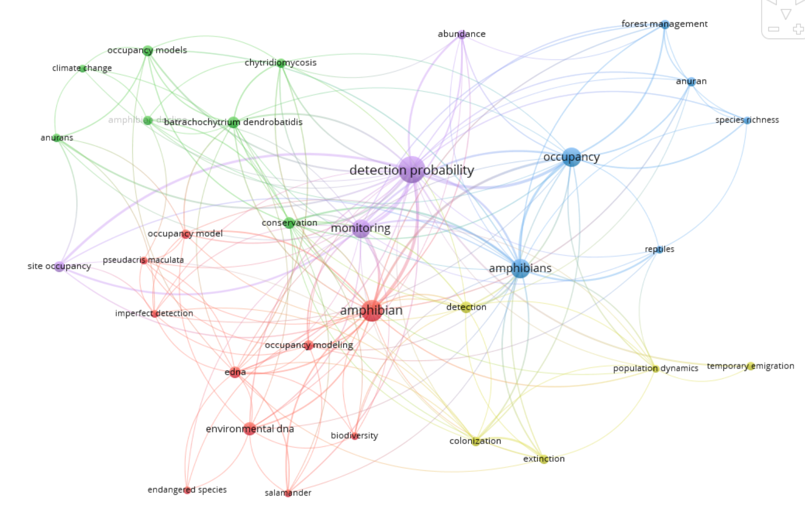
```

 
From this and my original selection I choose the most relevant keywords.  For example, here I will not select ‘reptiles’ or ‘forest management’ as my topic is not relevant to this. On the other hand, ‘detection probability’ is a very important keyword for my topic.

Next, use the tab ‘Overlay Visualisation’ to see how different aspects of this topic are important.

In the next visualisation (Figure \@ref(fig:keywords-VOSV2)), we will see how the year of publication impacts what keywords are used. 


(ref:keywords-VOSV2) **An output using author keywords from [Exercise 1](#finding) using VOSViewer.** Note that the most recent subjects (yellow) are ‘eDNA’ and ‘chytridomycosis’. 

We should consider adding these keywords if they are relevant to the study. If keywords look unfamiliar to you, then it might be worth reading some of the papers concerned and if you still don't understand if they are relevant then discuss it with your advisor.

```{r keywords-VOSV2, echo=FALSE, fig.align='center', out.width='90%', fig.cap="(ref:keywords-VOSV2)"}
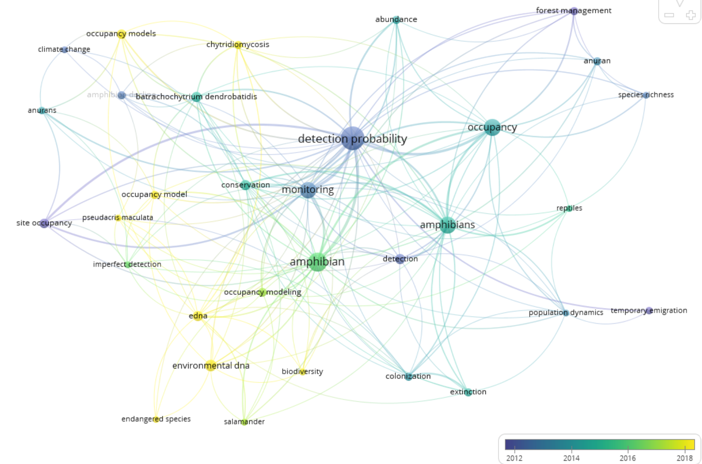
```

 
VOSViewer makes it easy to change the different Visualization Scores to reveal different aspects of your downloaded dataset. 
 

(ref:keywords-VOSV3) **An output using author keywords from [Exercise 1](#finding) using VOSViewer.** Note that most citations come from papers on anurans with detection probability, site occupancy and monitoring – but beware – older publications have more citations, so rather use ‘avg. norm. citations’ which takes account of the age of each publication.

```{r keywords-VOSV3, echo=FALSE, fig.align='center', out.width='90%', fig.cap="(ref:keywords-VOSV3)"}
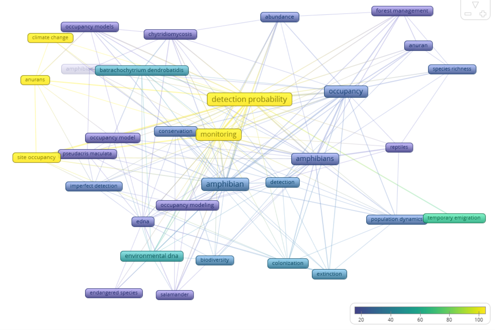
```

In Figure \@ref(fig:keywords-VOSV3), those publications with keywords in yellow are generating the most citations. This can give you some idea of what combinations of topics are most interesting to a wider audience, especially when they are more recent (see Figure \@ref(fig:keywords-VOSV2)).
 
### Answer the following questions:

 - How does using VOSViewer to visualise your keyword network in [Exercise 2](#visualising) add to what you have already done in [Exercise 1](#finding)?
 - Do you need to rethink your advanced search terms now that you have visualised your results? 
 - What other ways do you think would be able to help refine your advanced search term?
 
## Exercise 3: Setting up an alert {#alert}

For this you will need to register with an account in one of the literature databases. Let's look here at Scopus as they appear to have more services for Yunnan University. 


(ref:keywords-alert1) **To set your alert up in Scopus, click on the bell icon.** You will have to be logged in to set an alert, so set up your account if you haven't done so already

```{r keywords-alert1, echo=FALSE, fig.align='center', out.width='50%', fig.cap="(ref:keywords-alert1)"}
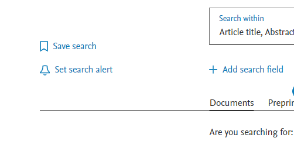
```

Here I have set up an alert for the query shown in both Exercise 1 and Exercise 2. Every Monday I will receive an email when new papers come out that fit these search criteria.

(ref:keywords-alert2) **Stipulate the notifications for your alert.** You can choose when you want your alert, and to which email address it should be sent. 

```{r keywords-alert2, echo=FALSE, fig.align='center', out.width='40%', fig.cap="(ref:keywords-alert2)"}
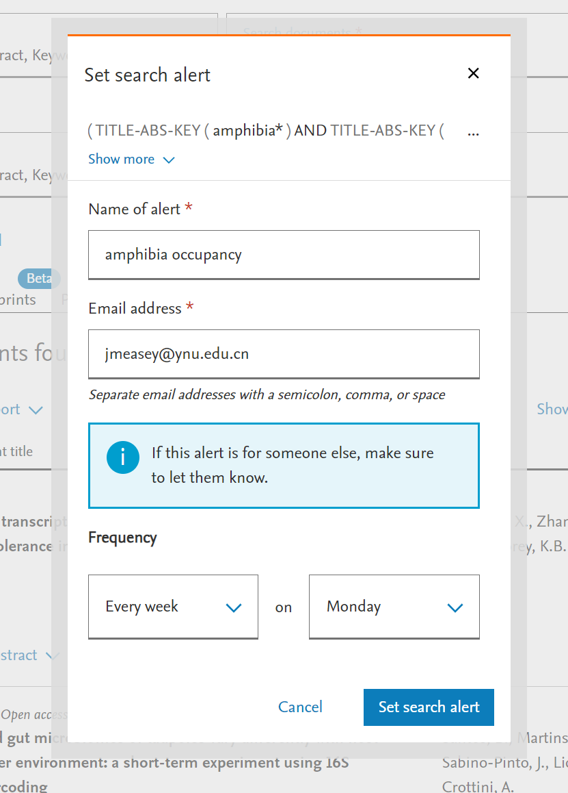
```

***

In this workshop, we have concentrated on finding literature that you should be reading in order to catch up and stay relevant with your own topic. If you have not been able to use your own topic for this workshop, then you still need to do this once you get enough information on your subject. Bookmark this page and make sure that you come back.

If you have now set up an alert as a result of doing this workshop, then you will start to receive emails alerting you to new literature. There are still some important action points:


  - Add the final set of literature that result from your best search term to your [reference manager](https://howtowriteaphd.org/referencesoftware.html)
  - In your [reference manager](https://howtowriteaphd.org/referencesoftware.html) make notes of what you want to read and make sure that you have access (see [here](https://howtowriteaphd.org/paywall.html))
  - When reading these papers that you have found, remember to [read critically](https://howtowriteaphd.org/critical.html)
  - Unless you read any of the literature that you have found, there will be no point in having found it - so **please read it**!
 
***

This is the end of this workshop on [Keywords](#keywords). If you find any problems with this workshop, please be sure to let me know. Email: [jmeasey@ynu.edu.cn](jmeasey@ynu.edu.cn)
