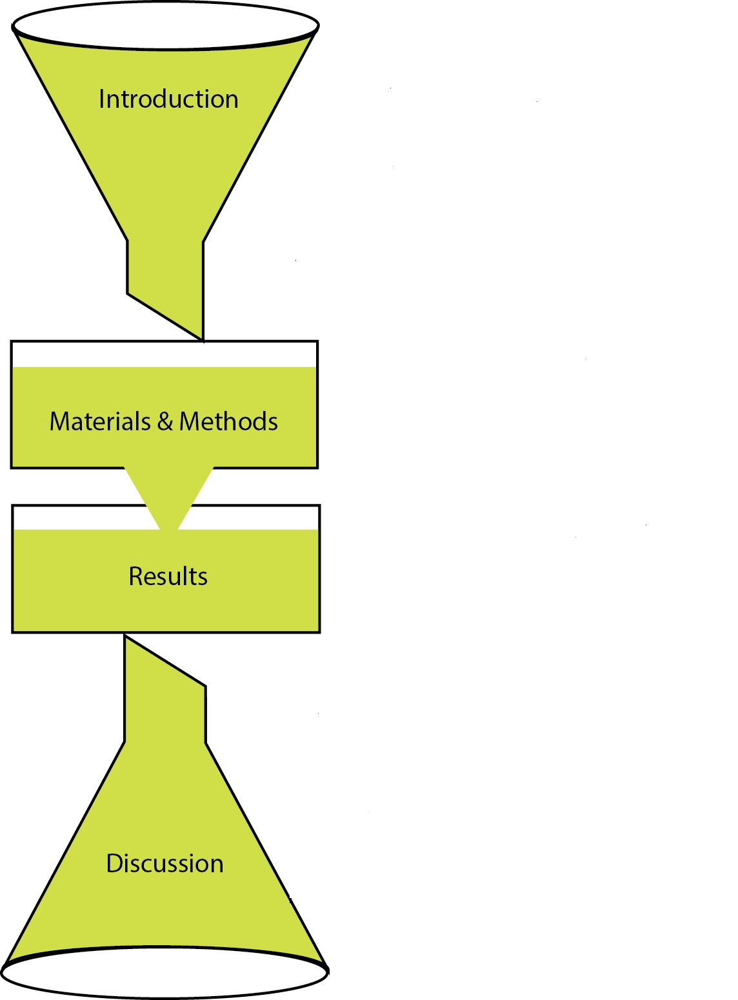
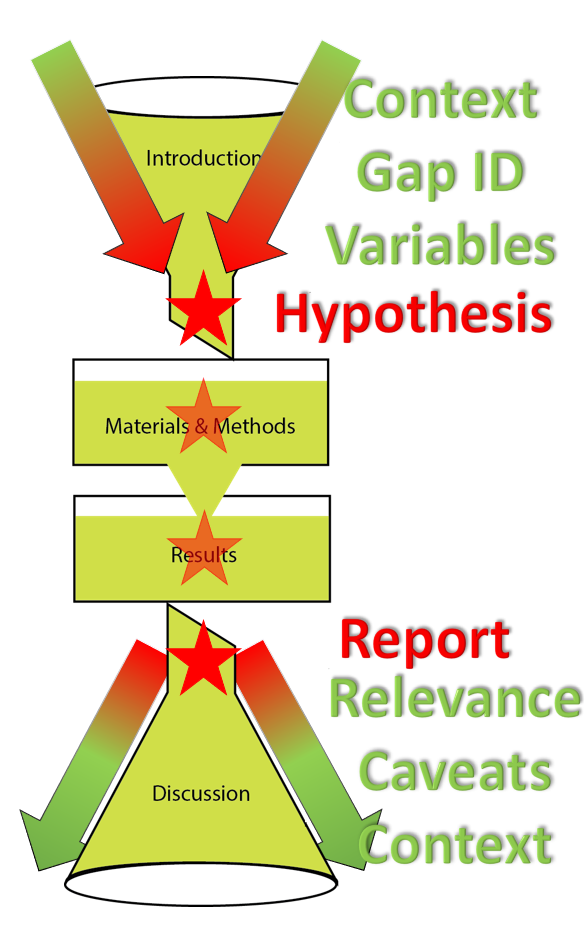
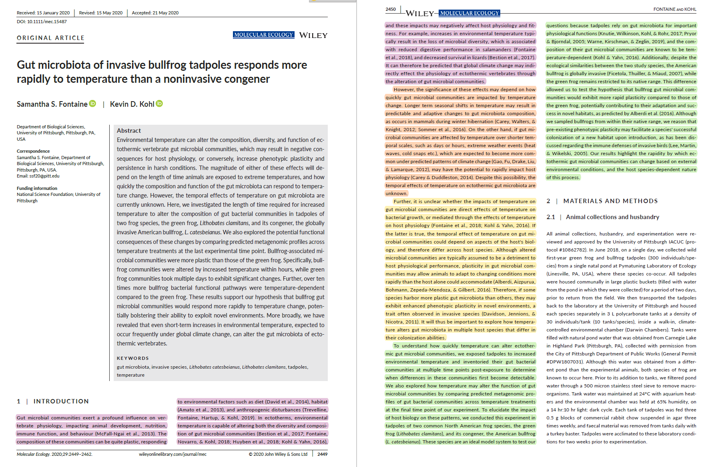
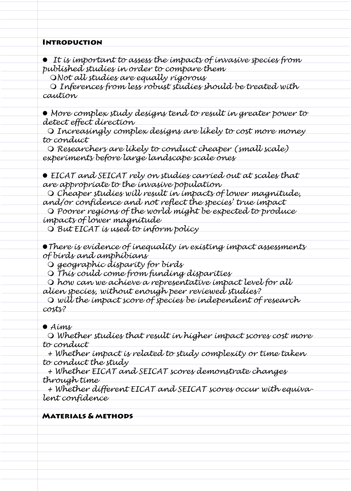
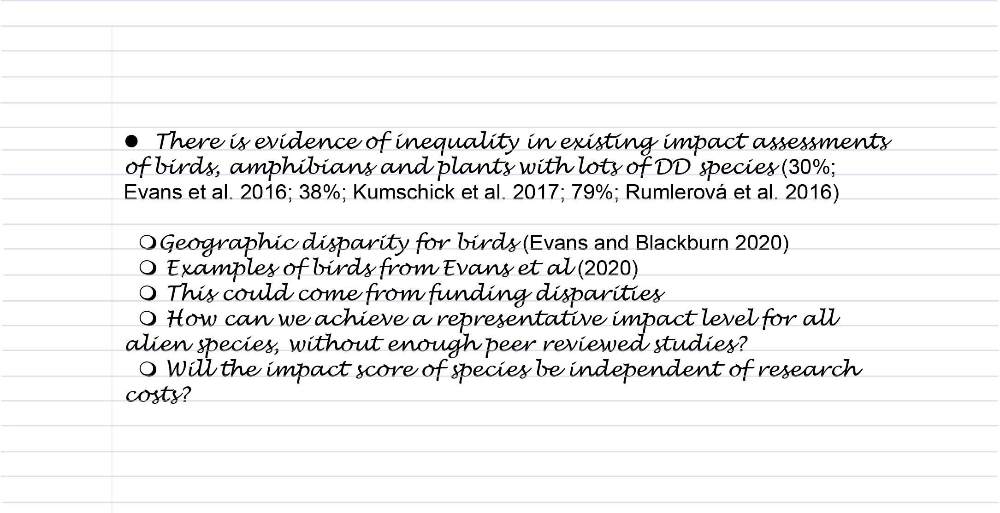

# Using a formula to write a chapter {#formula1}

Very few people can sit down at a desk and write an academic paper from beginning to end. For most of us, it takes a lot of hard work over many weeks or even months to write something that can be submitted. Sometimes it seems that every paper I read is just repeating the same formula over and over again. I even tend to forget that it's there until someone breaks the mould. Breaking the mould produces papers that really stand out, captivating the reader straight away. So why aren’t we writing those novel manuscripts every time we write a paper? Moreover, why don’t we teach students to write stand-out papers that will captivate everyone. Should we really be teaching formulaic writing?

Here I argue that not only is writing to a formula good practice, but it’s the best way to learn scientific writing. When you look to see who is writing those knock-out articles (i.e. "broken mould"), the answer is that they are really experienced researchers who have written hundreds of papers, and (unlike some of us) in doing so have learnt the essence of great writing. Such greatness is not innate and comes rarely to any researchers (even those who have written hundreds of papers). That's why I suggest to my students that they follow the formulas that are by now well recorded in many blogs and websites on scientific writing.

There is another reason why writing to a formula is recommended. Not only is it easier, but because it is so common and widespread, it also gives the reader a familiarity with reading your work. This means that editors are able to skim through and find exactly what makes your work worth publishing, and it means that those who are only semi-interested are more likely to find what they need to cite in your work.

In this workshop you will learn:

 - the typical formula for a paper in the natural sciences
 - how to spot formula in your key papers
 - plan your paragraphs in the introduction and discussion
 - turn formula plans into paragraph plans


## So what is the formula?

If we were in my office, at this point in the meeting I usually go to my white board and start drawing funnels (as a metaphor) and blocks. However, others have much better diagrams and here I’ve adapted an idea from Brian McGill’s blog [-@mcgill20165]. But you can also find other useful material in other papers [@turbek2016scientific; @plaxco2010art @tomaska2007teaching]. If you are of the Twitter persuasion, you get lots of useful tips and links from WriteThatPhD and Write4Research.

The diagram below (Figure \@ref(fig:formula-nw)) is supposed to show the movement of a liquid medium from one vessel to another. This is to make you think of your readers' understanding moving fluidly from one section to another. The introduction concentrates the ideas into your particular approach, while the discussion allows the reader to understand how your results fit into the larger body of knowledge. 

(ref:formula-nw) **Using a formulaic approach to writing your MSc or PhD chapter.** This diagram represents the formula of writing a paper or chapter that we will concentrate on in this book. Imagine the flow of the reader being like a liquid that passes from one section to the next. 

```{r formula-nw, echo=FALSE, out.width = '95%', fig.cap="(ref:formula-nw)"}
 
```

### The hypothesis at the heart of the formula

Having made the point that the formula is funnelling the readers' interest, the question arises: to what? What are we working towards? Why are we so interested in having the reader focus on a particular thing, and more importantly: what is that thing?

> The Hypothesis

Your hypothesis is the reason that you are conducting your study. You are trying to respond to it, trying to accept or reject it. Your hypothesis is why you are doing the study and you need your reader to get the context for this, and to understand exactly why it was that you posed this specific hypothesis. 

The hypothesis is then at the heart of everything that you write in your chapter (Figure \@ref(fig:formula-concept)): 

 - Your introduction explains why you posed the hypothesis
 - Your methods & materials describe how you went about testing your hypothesis
 - Your results provide the outcome of the tests of your hypothesis
 - Your discussion responds to your hypothesis and provides the context


(ref:formula-concept) **Your hypothesis lies at the heart of your MSc or PhD chapter.** Your hypothesis (red star) is at the heart of everything that you are writing about. The entire reason for providing the chapter is to test your idea. 

```{r formula-concept, echo=FALSE, out.width = '95%', fig.cap="(ref:formula-concept)"}
 
```


## **Exercise 1**: Spotting the formula in others' writing {#spotting}

In this exercise we are going to take the 5 papers that were identified at the beginning of this course (see [here](#welcome)). You can either print out these papers and work with coloured highlighter pens, or you can use the pdf versions in [Acrobat Reader](https://get.adobe.com/reader/). 

**NB: If one or more of your papers are reviews, this exercise may not work for them.** We will deal with literature reviews in another component of this course (here).


Using the introduction, we will summarise each paragraph into the generalisations of Figure \@ref(fig:formula). 


Here I have taken a paper from the [Keyword Topics](#ktopics) by Fontaine and Kohl [@fontaine2020gut]. 


(ref:formula-FnK1) **De-constructing a published paper to spot the formula.**  In this paper by Fontaine and Kohl [@fontaine2020gut] I have highlighted each paragraph in the introduction and broken it down into the formula given in Figure \@ref(fig:formula-nw).

```{r formula-FnK1, echo=FALSE, out.width = '95%', fig.cap="(ref:formula-FnK1)"}
 
```

In this example, the theme is climate change, the topic is the microbiome, they key variable is temperature and the study system are two anuran species. But to keep it general I will use the words: theme, topic, variable, study system.

 - Pink: 
     +  Overview of importance of topic including key variables.
     +  Example of key variable and impact on topic
     +  Prediction of theme on topic and key variable
 - Orange: 
     +  Identification of gap in knowledge concerning key variable and topic
     +  structured argument with examples on key variable resulting in changes to topic 
     +  Introduction of second variable of interest
 - Yellow: 
     +  Potential confounding factors on variables
     +  Structured argument with examples to justify study system
     +  Concluding justification of study system
 - Green: 
     +  Explanation of experimental approach
     +  Introduction to study system
     +  Statement of hypothesis
     +  Insight into results
     
It was relatively straightforward to determine each of the components (above) from reading the text. This is a relatively short introduction, and yours maybe longer. However, I would like you to conduct this breakdown of each introduction in each of your five papers. 
     
## **Exercise 2**: Where are the different aspects introduced? {#aspects}

Almost every paper has different aspects, each of which requires an introduction. These aspects are:

 - **theme** This is the big idea that the study fits within. Most studies cannot directly study an entire theme, but only one topic within it. Examples of themes are: evolution, climate change, conservation, ecology
 - **topic** This is a sub-discipline of the theme that usually determines that approach that you have taken to study the theme
 - **variable** These are the units of measure and manipulation in the study
 - **study system** This can be a cell, an organ, a species, a group of species, or an ecological system
 - **hypothesis** The question that the study is designed to answer

For each of your five papers, I want you to name each of the aspects (use the same terms as used in the paper), and state which of the paragraphs in the introduction they first occur in. Record your results in table like that given in Table \@ref(tab:aspects) for the example from [Exercise 1](#spotting).


Table: (\#tab:aspects) **The different aspects in the introduction and where they are introduced.** This example is taken from [Exercise 1](#spotting) and relates to Fontaine and Kohl [@fontaine2020gut].

| Aspect | Name | Paragraph number |
| -- | --- | - |
| **Theme** | climate change | 1 |
| **Topic** | Microbiome | 1 |
| **Variable** | Temperature | 1 |
| **Study system** | Two anuran species | 3 |
| **Hypothesis** | "bullfrog gut microbial communities would exhibit more rapid plasticity compared to those of the green frog..." | 4 |

**Question**: Are the order of the paragraphs always increasing for each of your aspects in each of your five papers?

***

## Starting to write with an outline

When you are ready to write your own chapter, or if you have already started, the way in which you go about this is to create the same sort of outline that we produced in [Exercise 1](#spotting). 

First list your different aspects that you have in the introduction of your chapter, as you did in [Exercise 2](#aspects).

Next, begin to plan out your formula as a bullet-point outline (Figure \@ref(fig:outline)). Start by writing a general sentence for the subject of each paragraph. Then use sub-points to plan each sentence within the paragraph. Lastly, annotate these with citations that you want to use. Personally, as an advisor, I'd prefer to see the bare outline before you start the writing proper. This allows advisor and student to get on the same page to be sure that what is planned is thought out. 

(ref:outline) **Example of an outline draft of the introduction.** In this outline taken from Measey et al. (2020), paragraphs are paragraphs are indicated by the solid dots, and points to make inside the paragraphs by hollow dots. Each paragraph has an argument sketched out within it.

```{r outline, echo=FALSE, out.width = '95%', fig.cap="(ref:outline)"}
 
```


In the above example, you may not know what EICAT and SEICAT are (they are scoring systems used for environmental - EICAT - or socio-economic - SEICAT - impacts of alien species), but I would hope that you can follow the broad argument of the introduction explaining why the study should be done. 

### Next flesh out the outline with citations

In the next stage, 'fleshing out', I ask that citations for statements above be added along with any examples. Figure \@ref(fig:outline-fleshed) is an example of the citations added to paragraph 4 above.

(ref:outline-fleshed) **Example of a fleshed out outline of a paragraph in the introduction.** In this outline taken from Measey et al. (2020), citations and relevant figures have been inserted for each of the statements. 

```{r outline-fleshed, echo=FALSE, out.width = '95%', fig.cap="(ref:outline-fleshed)"}
 
```


## Writing the text

And once you have the fleshed out outline, it’s time to start writing your first draft. Remember that the best way to start writing is to do just that. It's unlikely that your first effort will be the one that you will finally submit. But start writing. Then read, go back and polish. And keep polishing until you achieve your goal. 

Although we have concentrated on the introduction in this workshop, the same basic approach to filling out the formula can be taken with the rest of the chapter. We will go through this later in the course, but if you want to read further now you can find this covered in **[How to write a PhD in Biological Sciences]()**:

 - [The Intrpduction](https://howtowriteaphd.org/introduction.html)
 - [The Materials and Methods](https://howtowriteaphd.org/methods.html)
 - [The Results](https://howtowriteaphd.org/results.html)
 - [The Discussion](https://howtowriteaphd.org/discussion.html)
 
 
