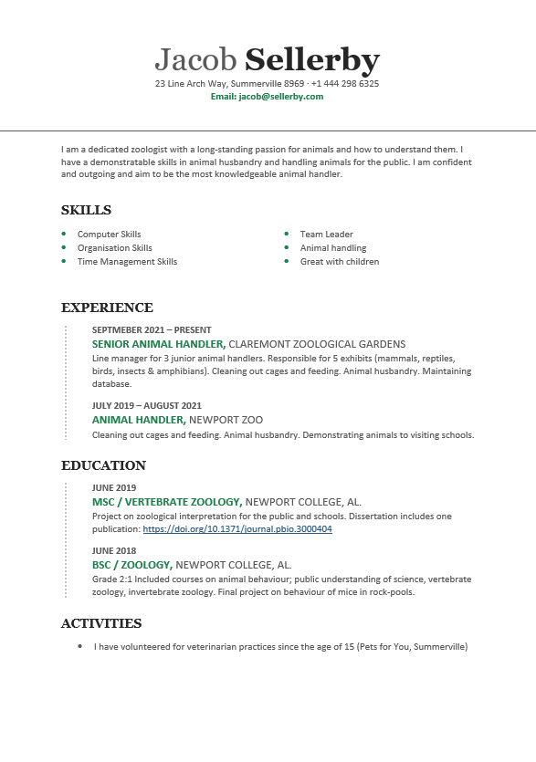

# Building your *Curriculum Vitae* (CV) {#CV}

When applying for jobs and various positions, most employers will ask for a CV: from the Latin *Curriculum Vitae* meaning the course of one's life. Most of you should already be familiar with the idea of a CV and many of you likely already have one. In this workshop, we concentrate on how to compose your CV and, more importantly, how to build your CV so that you cover all the bases that you need when applying for the jobs that you want.

Employers want a CV because it is a quick way of vetting applicants. You don't need me to tell you that applying for a job is a competitive environment. By conducting this workshop now, you should put yourself in the best position when applying for your dream job in the future.

**In this workshop we will:**

 - Learn the importance of candidate requirements
 - Find out how best to structure & format your CV
 - What to include & what to omit from your CV

**Before you start, you will need:**

 - A set of two or more advertisements for your ideal job. These must be the full adverts including all candidate requirements, and not abbreviated versions
 - All of the information that relates to your employment and education history. Dates, places, and names. If you already have a CV, then please bring this with you.
 - Access to a word-processor and try choosing two or three CV templates that appeal to you
 - Read all of the material below so that you are prepared for the workshop

## Understanding the use of CVs from the employers standpoint

You will make the best CV when you understand what it is that employers use them for. The following sections attempt to lay out how it is on the employers' side. 

### The chain of events that lead up to the job advertisement

It is important to understand that most job advertisements are the culmination of a long set of meetings and decisions taken and signed-off across lots of different departments of the hiring organisation. As such, the adverts themselves already represent a lot of work and commitment. Before a job is advertised, a typical large employer (i.e. one with an Human Resources -HR- department), will have an appointment team made up of someone from the HR department, the person who will be the line-manager and usually some representative colleagues and higher-ups. These people will decide upon the pay grade: usually a band of salary into which someone can be appointed. This will in turn dictate the qualifications and skills that can be advertised. This could be done in a series of emails or meetings, and may be straightforward or involve a lot of negotiations. 

Each job will have a set of **candidate requirements** (that may well be called the **person specification** or something similar) which will define who employers can consider (and who they can't). These requirements may be broken down into a set of **essential** and **desirable** qualifications and skills. This list and exactly what is listed as essential and what as desirable are often the subject of debate and negotiation between the colleagues and the HR department. For example, the colleagues may be replacing someone, and consider some skills essential, while the HR department will point out that the skills may be beyond the pay grade agreed for that position. For you, this means that even though some skills are only listed as desirable you should speak to these in your CV and job application where possible. They may be deal breakers in getting you an interview, if everyone else has them and you don't mention that you also do.

Once all the details of the advertisement have been agreed upon, the advert (as you see it) will be posted. The way most employment laws work the employer must hire a candidate consistent with the advertisement. Even if a better candidate comes along, if they don't meet the requirements of the advertisement the company cannot legally hire them. If they don't meet the essential criteria, they cannot be considered - even if they are a friend of the boss, or already work for the organisation. 

You may have realised by now that this is all quite a process involving a lot of people, time and effort. This is important background information to bear in mind when you are applying. It is also not impossible that there are mistakes in advertisements. For example, I have seen items listed in desirable that are also in the essential list. If you do spot an anomaly and are not sure what it means, then it is a good idea to contact the person listed on the job advertisement. In addition to clarifying any concerns you have, it will also show them that you have a good eye for detail and are happy to ask for clarifications - which is an important employee attribute.


### You will need a new CV for every job

Because every job advertisement will have a unique set of **essential** and **desirable** qualifications and skills, this means that your CV will need to be changed for every job that you apply for. If you are applying for the same kinds of jobs from many different potential employers, then the chances are that you will need to simply **tweak** your CV for each job. The core information on the CV, like your employment history and education, will not change, but other statements and highlights will need to be altered and swapped around. 

### Think of your CV as a checklist

Probably, the best way to think of your CV is a check-list that the employers are going to quickly move through and check against their job requirements. After the application deadline, they may well print off copies of all the CVs that they receive and physically tick of whether or not each applicant meets the **essential** criteria. You would want the person that does this to be the most invested party, i.e. the line-manager. But in fact, this job is often done by someone in the HR department, and could even be done by a junior HR staff member or even an intern. My point here is that the person that looks at your CV is not going to spend hours contemplating each word that you wrote, instead they will be spending less than a minute to check off whether or not you meet the requirements that were stipulated in the advertisement. This person will have two piles. Your aim is to make sure that your CV gets onto the small pile of applications to be considered, and does not go straight into the shredder. To make sure that you are in the right pile, you need to have got all of the requirements listed as essential featuring prominently on your CV.

Once your CV has made it through this check-list phase, the list of candidates that meet the requirements for the job will be circulated back to the hiring committee. The next phase is to choose the people that they want to short-list for interview. This is the point at which people will read what you have written on your CV in more detail. You may have been asked to submit some letter or application or another kind of test assignment. Depending on how many candidates there are in this round, the group involved may be looking for more reasons to junk excessive applications, or if you are lucky they may only have a few candidates that meet their requirements and you'll easily make it through this knock-out round.

### Getting onto the short-list

Your CV will still be important in the short-listing phase. Each member of the hiring committee will study the CVs together with all other material that they have on each candidate. If they are looking for reasons to drop excessive candidates, then any spelling mistakes or poor formatting may result in the end of your application chances here. 

On the other hand, if you have carefully crafted your CV for the job advertisement. If you have checked and double checked the content for this specific job, you are very likely to cruise through this round and be considered for the short-list. Remember, that if there are a lot of candidates, making the short-list may be more about having a lot of the **desirable** criteria specified, and not just those **essential** ones. 

### From the short-list to the interview

Don't forget that you will need your CV if you are called to interview. You will need to take it with you to remind yourself of exactly what is on it. You will also need to make sure that it is the same version that you submitted for that specific job. 

It's a good idea to make some notes on the version that you submitted so that you can quickly recall exactly why you wrote what you did in each place. Also remember to take a copy of the original advertisement.

Your potential employers will likely have your CV (and the others) printed out and sitting on the table at the interview, together with anything else that you sent. They can and will ask you questions about what it written on it, so it's a good idea to have your own copy.

***

## **Exercise 1**: Identify the candidate requirements for your ideal job {#tableidealjob}

Before you came to this workshop, you were asked to bring with you two or more advertisements for your ideal job. These must be the full adverts including all candidate requirements, and not abbreviated versions. In this first exercise, we will look at these candidate requirements and divide them up into skills, qualifications and previous experience. 

1. Go through the advertisements for your ideal job, and make a table with columns for each job and rows for each of the skills, qualifications and previous experience they have in their candidate requirements. (See the example below in Table \@ref(tab:candidaterequirements))
1. Fill in the table with crosses corresponding to the candidate requirements
1. Add any new or additional candidate requirements

Table: (\#tab:candidaterequirements) **The candidate requirements for your ideal job.** Note how each job is listed as a column and the different requirements are grouped into skills, qualifications and previous experience. Because the jobs are similar, many of these jobs share the same candidate requirements.

| Candidate Requirements | San Diego Park | Florida Game Zoo | Montana Animal Experience |
| ----- | - | - | - |
| **Skills** | - | - | - |
| Strong computer software skills | X | X | X |
| Excellent organisation, communication and time management | X | X | X |
| Ability to follow animal handling protocols | X | - | X |
| ----- | - | - | - |
| **Qualifications** | - | - | - |
| BSc or equivalent | X | X | - |
| Background check | - | X | X |
| Driving licence | X | X | X |
| ----- | - | - | - |
| **Previous experience** | - | - | - |
| Volunteering in sector | X | - | - |
| Teaching in schools | - | X | X |

Q. How many of the jobs that you have ask for exactly the same candidate requirements?

Q. Compare your table with that of the people sitting with you in the workshop. How similar are the candidate requirements for your ideal job to theirs? 

Q. What are the most diverse candidate requirements?

***

### Requirements for a CV template {#cvtemplate}

**Some general rules for good presentation.**

1. Don't use a lot of different colours or fancy fonts. Try to keep your style clean and professional.
1. Minimum font size should be 11 pt. Headings should be larger and in bold. 
1. Don't use block capital letters. These make it harder to read quickly and often result in reading errors.
1. Maximum length should be two sides, i.e. one piece of paper when printed
1. If you go onto the second side, try to fill at least half
1. Make sure that when printed in monochrome, all of the information is still easy to read

**Your CV template must have the following:**

1. Header that includes your name and contact details. Make sure that these are all very clear and easy to read. 
1. The template must have room for a statement, skills, qualifications, previous experience and educational background
1. The template should be balanced across the page, making use of all the available space
1. The second side should include your name and contact details again


(ref:CV-template) **A CV template.** Even though this CV template might look ok at first glance, there are several things that I don't like about it. Compare what you see here with the list above and see which items need changing. 

```{r CV-template, echo=FALSE, fig.align='center', out.width='90%', fig.cap="(ref:CV-template)"}

```

***


## **Exercise 2**: Constructing your CV

Before you came to this workshop, you were asked to accumulate all the information needed to put together your CV. You were also asked to pick out a few templates that you like. In this exercise, we are going to fill out the best template that you chose, and alter it for each of the jobs that you identified in [Exercise 1](#tableidealjob). 

Using your [ideal CV template](#cvtemplate), complete your CV for each of the job adverts as best you are able.

Q. Did you manage to complete every field?

Q. Once you had completed the CV for the first job, how much work did it take to change it?

Q. Looking at the CVs of the other people in your group, how different are they to your own?


***

## What to omit from your CV

 - Photos - these are popular in some countries, but in general these aren't needed to short-list you.
 - Social Media - unless it is professionally curated to your job.
 - Hobbies & Sports: in general these are padding. Some big corporations might have their own clubs and societies, in which case, these points have relevance. Do your research before deciding to include them.
 - Babysitting; dog walking; car washing; school plays; clubs; unless these are relevant.
 

### If your CV is getting too long

As you build experience, your CV will grow and eventually may push more than two sides. In this situation, you need to decide what to omit. The first casualties will be the details of your High School, and any positions that may have gone on a different career path. If you are pushed for space, only keep the last three relevant appointments or cover 10 years. Next, you should consider how to make each section shorter by tailoring the content more closely to the job advertisement. 

**Remember the aim of your CV is to get through the short-listing.** 

## Building your CV

Once you have written your CV for ideal adverts in this workshop, you should now be acutely aware of where you are a strong candidate and the parts of your CV that are lacking or have components missing. It is tempting to be depressed at how inadequate your CV is for the jobs that you want, but instead it is important for you to think of this exercise as empowering. What you've managed to do is highlight all the areas that you need to build upon before you are ready to apply for your ideal job. 

Several opportunities open up to you:

1. You might need to apply for a different job that you do for a shorter period (e.g. two years) to build up your CV to a point where you can apply for the job that you want.

1. You may be in a position where you can opt to do some extra duties that specifically fill key areas of your CV so that you can apply for positions that you want. Talk to your current line-manager about doing these additional duties.

1. Similarly, there may be things that you currently do in your present job that aren't helpful or applicable moving forwards. Talk to your line-manager about how these could be changed to make them more relevant.

1. If you aren't in a position or have no options like this in your current job, then consider doing some volunteering or an internship that will get you these items for your CV. 

The really important lesson to take away from this workshop is that now that you know what is missing from your CV, you are able to fill those gaps so that you can apply for your dream job and have the best chance of getting it.


***

## Summing up this *Curriculum Vitae* workshop

In this workshop, we have concentrated on how to tailor your CV towards your ideal job. This entails a lot of preparation on your part, but it also requires an appreciation of the employers and what they are going through to find the best candidate for their vacant position. There is a lot of work on both sides. Your objective is to try to make the job of your prospective employers as easy as possible. 

You will have learned how to:

 - determine what the employers are looking for
 - how to make sure that you meet the requirements for your ideal job
 - change your CV in order to meet the job specifications and get short-listed for interview
 
To take workshop forwards, you should now be thinking about how to fill in any missing skills or qualifications that you need for your ideal job. 

Ask yourself: 

 - If you do not already have all of the required skills or experience, how can you best go about acquiring them? 
    +  Is this something that you can do in your current position? 
    +  If not, what are your options to volunteer or find another job?
 - If you have all of the essential requirements, what else would make your CV look better?
    +  How can you best make that change?
    
***

This is the end of this workshop on [Building your *Curriculum Vitae*](#hyp-building). If you find any problems with this workshop, please be sure to let me know. Email: [jmeasey@ynu.edu.cn](jmeasey@ynu.edu.cn)
